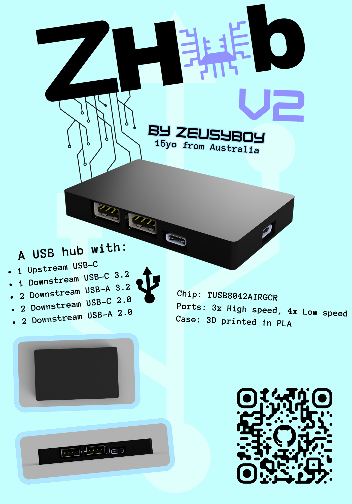
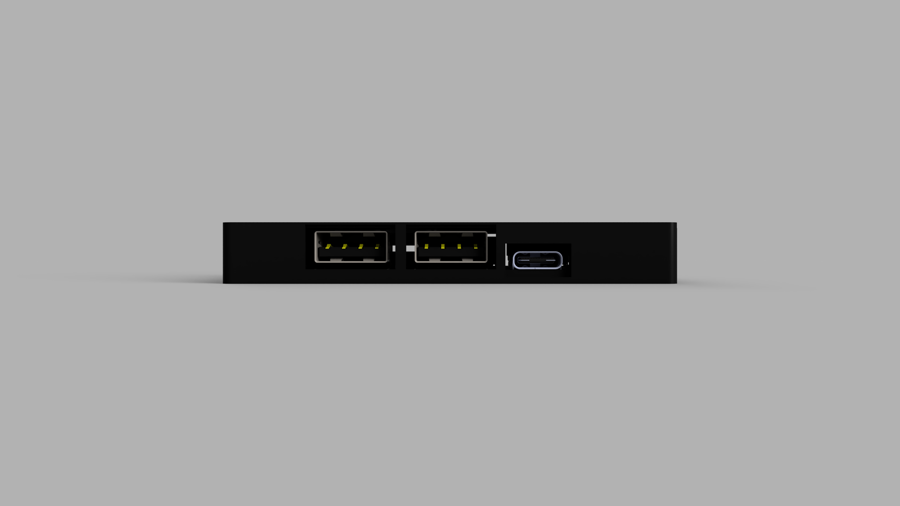
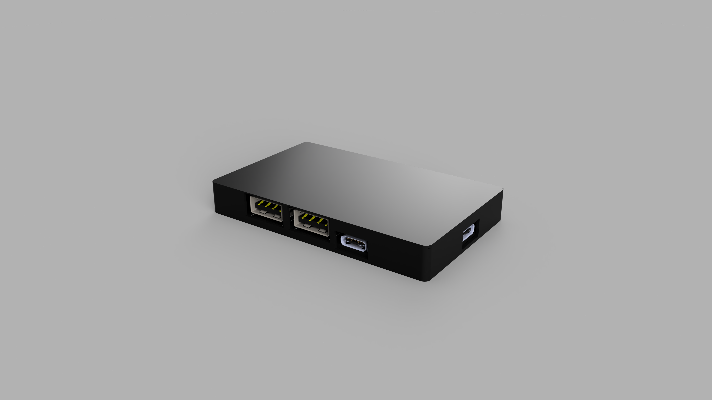
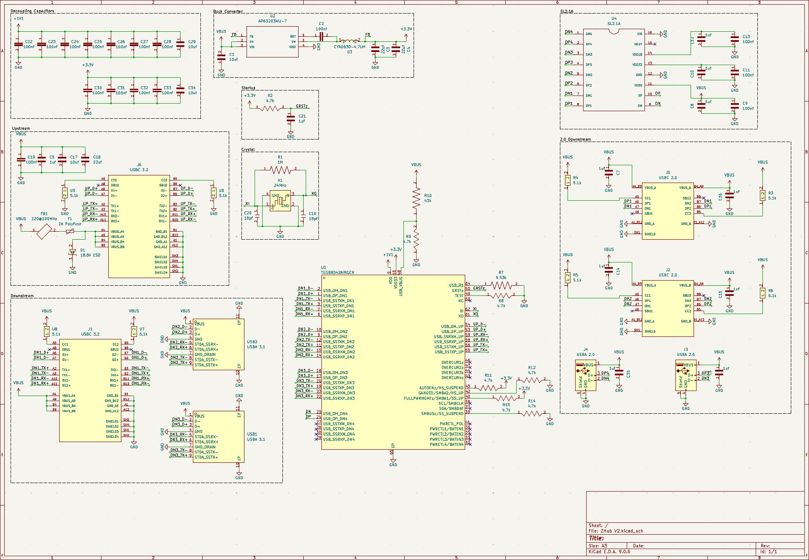
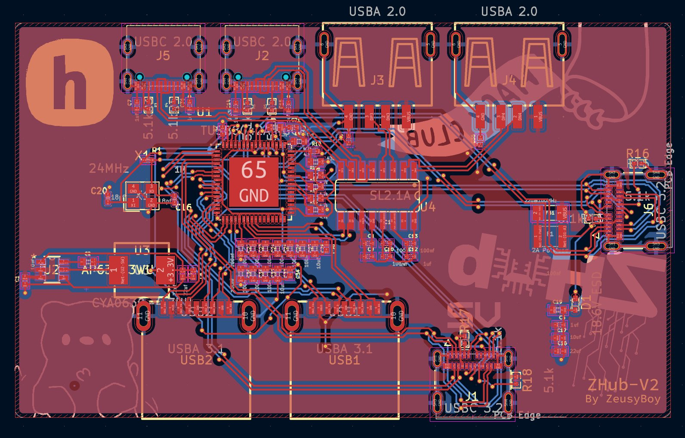
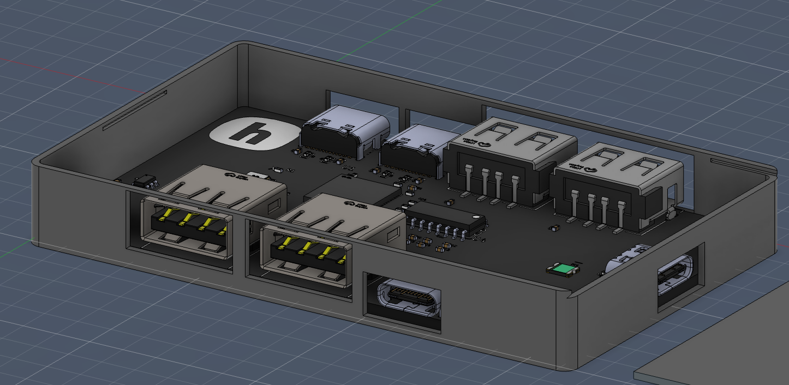

# ZHub-V2
A complex USB 3.2 Hub to suite my needs.
Made for Hack Club Fallout

## Zine

## What?
A basic USB hub with:
<ul>
<li> 1 Upstream USB-C
<li> 1 Downstream USB-C 3.2
<li> 2 Downstream USB-A 3.2
<li> 2 Downstream USB-C 2.0
<li> 2 Downstream USB-A 2.0
<li> USB 2.0 because I used a very basic chip
</ul>

## Why?
Because I don't have any USB-C USB hubs and A to C adapters are annoying. If I can just have one good USB hub on me at all times, that can allow me to plug all the stuff I could possibly need in, then that achieves my goal.

## How?
In order to make this project for yourself, you'll need to purchase the board and get it assembled through PCBA with all the components below (PCB manufacturer-acceptable BOM at PCB/Gerbers/bom.csv). You'll also have to 3D print the case.
| Quantity | Item                    | URL                                               | Unit Price ($USD) | Total Price ($USD) |
| -------- | ----------------------- | ------------------------------------------------- | ----------------- | ------------------ |
| 5        | CoreChips SL2.1A        | https://www.lcsc.com/product-detail/C192893.html  | 0.2522            | 1.26               |
| 10       | USB A 2.0 Receptacle    | https://www.lcsc.com/product-detail/C668591.html  | 0.0667            | 0.67               |
| 20       | USB C 2.0 Receptacle    | https://www.lcsc.com/product-detail/C2765186.html | 0.0666            | 1.33               |
| 100      | 1uf Capacitor           | https://www.lcsc.com/product-detail/C107372.html  | 0.0019            | 0.19               |
| 100      | 100nf Capacitor         | https://www.lcsc.com/product-detail/C309458.html  | 0.0012            | 0.12               |
| 100      | 5.1k Resistor           | https://www.lcsc.com/product-detail/C2906874.html | 0.0006            | 0.06               |
| 5        | TUSB8042A               | https://www.lcsc.com/product-detail/C2860610.html | 8.1684            | 40.84              |
| 10       | USB A 3.1 Receptacle    | https://www.lcsc.com/product-detail/C309458.html  | 0.23              | 2.3                |
| 5        | USB C 3.2 Receptacle    | https://www.lcsc.com/product-detail/C134092.html  | 1.0565            | 5.28               |
| 20       | ESD Diode               | https://www.lcsc.com/product-detail/C82044.html   | 0.0359            | 0.72               |
| 10       | 24Mhz Crystal           | https://www.lcsc.com/product-detail/C5444545.html | 0.0615            | 0.62               |
| 10       | Polyfuse                | https://www.lcsc.com/product-detail/C883135.html  | 0.0616            | 0.62               |
| 10       | 22uf Capacitor          | https://www.lcsc.com/product-detail/C105226.html  | 0.0455            | 0.46               |
| 100      | 18pf Capacitor          | https://www.lcsc.com/product-detail/C106202.html  | 0.0012            | 0.12               |
| 100      | 10uf Capacitor          | https://www.lcsc.com/product-detail/C315248.html  | 0.0092            | 0.92               |
| 10       | 9.53k Resistor          | https://www.lcsc.com/product-detail/C6127312.html | 0.0682            | 0.68               |
| 100      | 4.7k Resistor           | https://www.lcsc.com/product-detail/C105871.html  | 0.0008            | 0.08               |
| 100      | 43k Resistor            | https://www.lcsc.com/product-detail/C185415.html  | 0.001             | 0.10               |
| 100      | 1M Resistor             | https://www.lcsc.com/product-detail/C138033.html  | 0.0009            | 0.09               |
| 5        | 220@100MHz Ferrite Bead | https://www.lcsc.com/product-detail/C454099.html  | 0.151             | 0.76               |
| 5        | 3.3V Buck Converter     | https://www.lcsc.com/product-detail/C780769.html  | 0.4705            | 2.35               |
| PCB      |                         |                                                   | 5.2               | 5.2                |
| PCBA     |                         |                                                   | 145.82            | 145.82             |
| Shipping |                         |                                                   |                   | 10.51              |
| Total    |                         |                                                   |                   | 161.53             |

### Build Guide:

#### 1. Preparation 
Before starting, make sure you have:
<ul>
<li>The gerbers, pick and place files, and BOM, all available in this repository
<li>A 3D printer (or get the printed parts from someone else)
</ul>

#### 2. Ordering
Go to your PCB manufacturer of choice (Make sure they have PCBA) and follow their instructions on how to order.

#### 3. Case
3D print the print file, CAD/ZHub-V2-Print.3mf  
This has all the case parts you need (top and bottom)

#### 4. Assembly
Once the case has finished printing, place the assembled PCB into said case, then get the lid and slide it into the grooves of the bottom half of the case to close it.

#### 5. Profit
Plug a USB-C to C cable into the upstream port of the hub (the one not next to any other ports), and plug the other end of that cable into your computer. Then plug whatever USB devices into the downstream ports and...

This project does not need firmware, so you're good to go!

Enjoy your ZHub!!!

## Renders

## Designing

